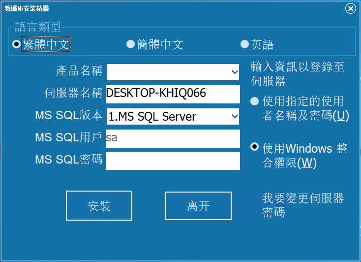

# DBInstall
愛招飛產品使用示例的資料庫，請在安裝產品時同步匯入對應產品的數據。

> **加入 Facebook 社團**
>
> [https://www.facebook.com/groups/isoface/](https://www.facebook.com/groups/isoface/)
> 
> **點讚追蹤 Facebook 粉絲專頁**
> 
> [https://www.facebook.com/AIOT.ERP](https://www.facebook.com/AIOT.ERP)

## 簡介

資料庫安裝精靈(DBInstall)是愛招飛推出的輔助安裝工具，用於將愛招飛產品中所使用的示例資料庫掛載至資料庫伺服器中。在使用該產品前，請先在資料庫伺服器中安裝配置完成資料庫系統管理軟體的安裝。該安裝精靈只能在需要掛載資料庫的本機使用，不支援遠端掛載。

|欲安裝的產品|	資料庫安裝精靈對應需安裝的產品名稱|
|---|---|
|[FastERP](https://github.com/isoface-iot/FastERP)|	FastERP、demo|
|[Smart](https://github.com/isoface-iot/Smart)|demo|
|[PinToo](https://github.com/isoface-iot/PinToo)|demo|
|[FastWeb](https://github.com/isoface-iot/FastWeb)|	Frame、demo|
|[TARS](https://github.com/isoface-iot/TARS)|	demo|